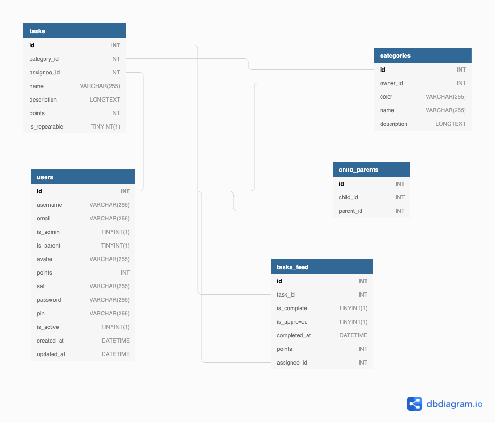

# db

## Purpose

This repository hold the database design of ChoreRewards

## Future

This project may include the migration management tools for the database as well, but for now it's somewhere to put the design only.

## DB Design

## ToDo

* [ ] Add `rewards` table, which shows a list of things that can be purchased with points
* [ ] Add `transactions` table, which shows a list of purchases
